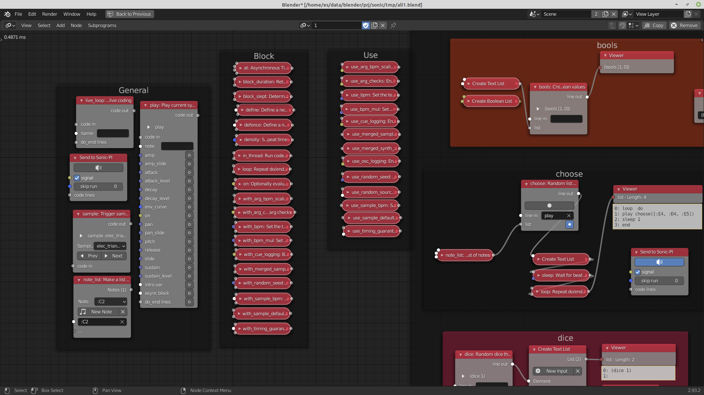

                                           ╘
                                    ─       ╛▒╛
                                     ▐╫       ▄█├
                              ─╟╛      █▄      ╪▓▀
                    ╓┤┤┤┤┤┤┤┤┤  ╩▌      ██      ▀▓▌
                     ▐▒   ╬▒     ╟▓╘    ─▓█      ▓▓├
                     ▒╫   ▒╪      ▓█     ▓▓─     ▓▓▄
                    ╒▒─  │▒       ▓█     ▓▓     ─▓▓─
                    ╬▒   ▄▒ ╒    ╪▓═    ╬▓╬     ▌▓▄
                    ╥╒   ╦╥     ╕█╒    ╙▓▐     ▄▓╫
                               ▐╩     ▒▒      ▀▀
                                    ╒╪      ▐▄
                                  |
                                  |
                                  |
                          -----------------                
                                  |
                                  |
                                  |
                              bbbbb                     
                             bl+/++ebb                  
                             ble//::/elb                
                               ble+/:::+elb             
                bbbbbbbbbbbbbbbbblll+::::/+eb           
               le///::::::::::::::::::::::::/elb        
               le+//////////:::-------::::::::/+eb      
               bbllllllllle/:----.```   ``.-:::::+eb    
                     bee+/:::--`   `..-..    .:::::el   
                  bble/::::::-`  `:++++++e+.  `/+++/el  
                ble+/::::::::`  `++++elb   b```-+++++ll 
             bee+/////++/::::```.+el        .``.++++/ee 
          bbee+/////eele/::::-```/         /```/++++/el 
         ee+/////+elb le///::/:...-/elble/..../++++//l  
        ll//+//+elb    l+///++++:-.........-:+++++//eb  
         le++elb        be/++++++++///:///+++++++//ed   
           l              l+/++++++++++++++++++//+bn    
                            b+////+++++++++///+e n      
                               dbe++/////++e dn         
                                   nn   n               
# Blend-sonic
## make sound with graphics

Blend-sonic is a new way to use Sonic Pi and sync to the 3D Blender scene. 

Blend-sonic has been designed with the aim to make Sonic Pi easy to write and play with.
This let you connect sound events(Sonic PI programs) to 3D object actions/animations in Blender.

### Motivations
Livecoding music is cool, but I got tired of the "coding" part and write and remember all the options

Moreover controlling the music/sounds inside blender it's very useful because you can use all the 
3D enviroment variables to control when and how this applies to the sound


Blend-sonic is made out of 
* a small [Blender](https://blender.org). plugin/addon that take care of the OSC comuication with Sonic PI
* hundreds of nodes (reflecting sonic-pi language) inside  [Animation Nodes](https://github.com/JacquesLucke/animation_nodes) addon 
that let you build a [Sonic Pi](https://github.com/sonic-pi-net/sonic-pi) program. 
This program is sent live via osc to sonic-pi for every small change. The entire operation usually takes place in few ms (depending on the node-tree) 

### what is Sonic PI?

[Sonic Pi](https://github.com/sonic-pi-net/sonic-pi) is a complete open source programming environment originally
designed to explore and *teach programming concepts* within schools through
the process of creating *new sounds*.

In addition to being an engaging education resource it has evolved into
an *extremely powerful* and performance-ready *live coding instrument* suitable
for professional artists and DJs.

### what is Blender?
A powerful 3D program that render even the music if you ask it to... :)
more on [Blender](https://blender.org)
### what is Animation Nodes?

[Animation Nodes](https://github.com/JacquesLucke/animation_nodes) is a node based visual scripting system designed for motion graphics in [Blender](https://blender.org).




## Information for developers

Blend-sonic is under active development, and welcomes new contributors

* [License](LICENSE.md)

